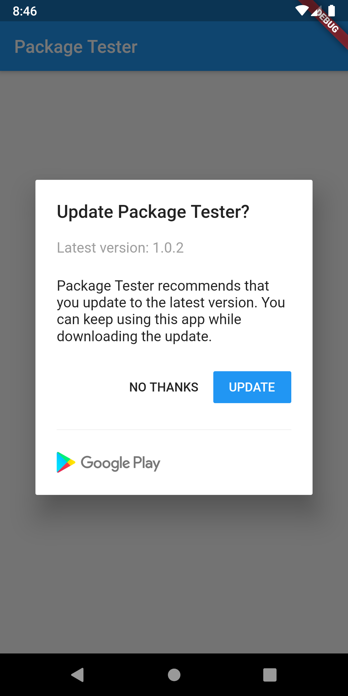

# native_updater

Flutter package for prompting users to upgrade with native dialog when there is a newer version of the app in the store.

When a newer app version is availabe in the app store, a simple alert prompt widget. With today's modern app stores, there is little need to persuade users to upgrade because most of them are already using the auto upgrade feature. However, there may be times when an app needs to be updated more quickly than usual, and nagging a user to upgrade will entice the upgrade sooner. Also, with Flutter supporting more than just Android and iOS app stores in the future, it will become more likely that users on other app stores need to be nagged about upgrading.

The UI comes in two flavors: Material Design for Android and Cupertino for iOS. The [UpgradeMaterialAlert](#material-alert-example) widget is used to display the
native Android alert prompt, and the [UpgradeCupertinoAlert](#cupertino-alert-example) widget is used to display the native iOS alert prompt.

## Installation via GitHub (for test only)

```yaml
dependencies:
  flutter:
    sdk: flutter
  cupertino_icons: ^0.1.3

  # Add this inside pubspec.yaml
  native_updater:
    git: https://github.com/loadsmileau/native_updater
```

## Additional setting for iOS

To be able to show your App Name in the Cupertino Alert Dialog, add the following keys to your _Info.plist_ file, located in `<project root>/ios/Runner/Info.plist`:

```plist
<key>CFBundleDisplayName</key>
<string>YOUR APP NAME</string>
```

## Usage

Just add this code inside the `initState()` life cycle method on the first home screen of your app, and it will handle the rest.

```dart
Future.delayed(Duration.zero, () {
      NativeUpdater.versionCheck(
        context: context,
        appStoreUrl: '<Your App Store URL>',
      );
    });
```

## Full Example

```dart
import 'package:flutter/material.dart';
import 'package:native_updater/native_updater.dart';

void main() => runApp(MyApp());

class MyApp extends StatelessWidget {
  @override
  Widget build(BuildContext context) {
    return MaterialApp(
      title: 'native_updater example',
      home: Home(),
    );
  }
}

class Home extends StatefulWidget {
  @override
  _HomeState createState() => _HomeState();
}

class _HomeState extends State<Home> {
  @override
  void initState() {
    super.initState();

    Future.delayed(Duration.zero, () {
      NativeUpdater.versionCheck(
        context: context,
        appStoreUrl: '<Your App Store URL>',
      );
    });
  }

  @override
  Widget build(BuildContext context) {
    return Scaffold(
      appBar: AppBar(
        title: Text('Package Tester'),
      ),
      body: Center(
        child: Text('Testing...'),
      ),
    );
  }
}

```

## Screenshot of Material Alert



## Screenshot of Cupertino Alert


