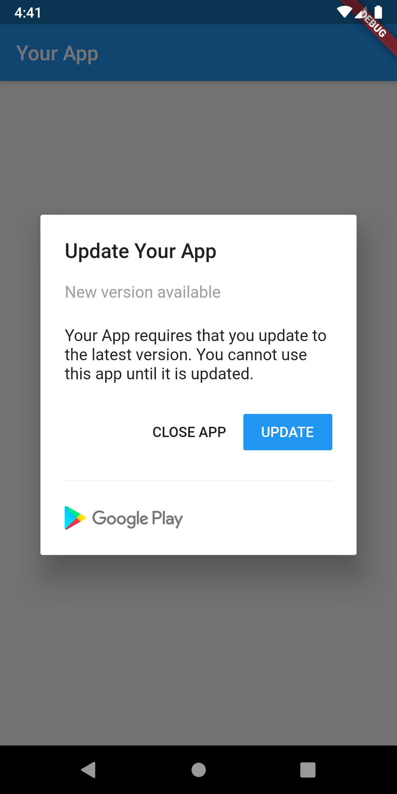
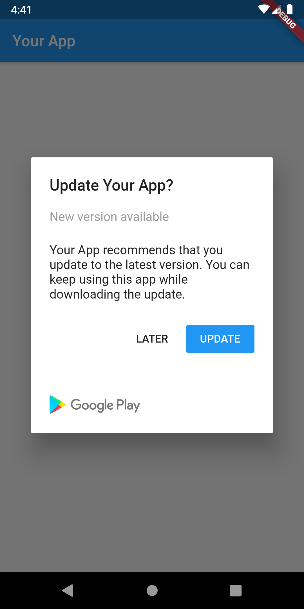

# native_updater

[](https://pub.dev/packages/native_updater)

> Flutter package for prompting users to update with a native dialog whether using the app store version or any version at the user's discretion.

When a latest app version is available via user defined logic, a simple alert prompt widget is displayed. With today's modern app stores, there is little need to persuade users to update because most of them are already using the auto update feature. However, there may be times when an app needs to be updated more quickly than usual, and nagging a user to update will entice the update sooner.

The UI comes in two flavors: Material Design for Android and Cupertino for iOS. The [UpgradeMaterialAlert](#material-alert-example) widget is used to display the native Android alert prompt, and the [UpgradeCupertinoAlert](#cupertino-alert-example) widget is used to display the native iOS alert prompt.

## Installation via GitHub (for test only)

```yaml
dependencies:
  flutter:
    sdk: flutter
  cupertino_icons: ^0.1.3

  # Add this inside pubspec.yaml
  native_updater:
    git: https://github.com/loadsmileau/native_updater
```

## Setup

### Android

Already good to go.

### iOS

To be able to show your App Name in the Cupertino Alert Dialog, add the following keys to your _Info.plist_ file, located in `<project root>/ios/Runner/Info.plist`:

```xml
<key>CFBundleDisplayName</key>
<string>YOUR APP NAME</string>
```

## Usage

Just add this code whenever you want to display the update alert, and it will handle the rest.

```dart
NativeUpdater.displayUpdateAlert(
  context,
  forceUpdate: true,
);
```

Or with the optional parameters to customize the alert.

```dart
NativeUpdater.displayUpdateAlert(
  context,
  forceUpdate: true,
  appStoreUrl: '<Your App Store URL>',
  titlePrefix: '<Your Title Prefix>',
  description: '<Your Description>',
  updateButtonLabel: '<Your Update Button Label>',
  closeButtonLabel: '<Your Close Button Label>',
);
```

## Parameters Explanation

### Required Parameters

**context** is the location in the tree where this widget builds.

**forceUpdate** is to tell whether the alert is forcing an update or not. Set to true if you are forcing an update. Set to false if you are giving an option to update later.

### Optional Parameters

**appStoreUrl** is to launch your App Store URL if you're also developing for iOS.

**titlePrefix** is to prefixing the alert title before your app name. The default is `Update`.

**description** is to use your custom alert description. The default is `<App Name> requires that you update to the latest version. You cannot use this app until it is updated.` or `<App Name> recommends that you update to the latest version. You can keep using this app while downloading the update.`

**updateButtonLabel** is to use your custom Update Button Label. The default is `Update`.

**closeButtonLabel** is to use your custom Close Button Label. The default is `Close App` or `Later`.

## Full Example

```dart
import 'package:flutter/material.dart';
import 'package:native_updater/native_updater.dart';

void main() => runApp(MyApp());

class MyApp extends StatelessWidget {
  @override
  Widget build(BuildContext context) {
    return MaterialApp(
      title: 'native_updater example',
      home: Home(),
    );
  }
}

class Home extends StatefulWidget {
  @override
  _HomeState createState() => _HomeState();
}

class _HomeState extends State<Home> {
  @override
  void initState() {
    super.initState();
    checkVersion();
  }

  Future<void> checkVersion() async {
    /// For example: You got status code of 412 from the
    /// response of HTTP request.
    /// Let's say the statusCode 412 requires you to force update
    int statusCode = 412;

    /// This could be kept in our local
    int localVersion = 9;

    /// This could get from the API
    int serverLatestVersion = 10;

    Future.delayed(Duration.zero, () {
      if (statusCode == 412) {
        NativeUpdater.displayUpdateAlert(
          context,
          forceUpdate: true,
          appStoreUrl: '<Your App Store URL>',
          titlePrefix: 'Upgrade',
          description: '<Your description>',
          updateButtonLabel: 'Upgrade',
          closeButtonLabel: 'Exit',
        );
      } else if (serverLatestVersion > localVersion) {
        NativeUpdater.displayUpdateAlert(
          context,
          forceUpdate: false,
          appStoreUrl: '<Your App Store URL>',
          titlePrefix: 'Upgrade',
          description: '<Your description>',
          updateButtonLabel: 'Upgrade',
          ignoreButtonLabel: 'Next Time',
        );
      }
    });
  }

  @override
  Widget build(BuildContext context) {
    return Scaffold(
      appBar: AppBar(
        title: Text('Your App'),
      ),
      body: Center(
        child: Text('Testing...'),
      ),
    );
  }
}
```

## Screenshots of Material Alert

|                 Force Update                 |               Can Update Later               |
| :------------------------------------------: | :------------------------------------------: |
|  |  |

## Screenshots of Cupertino Alert

|                 Force Update                  |               Can Update Later                |
| :-------------------------------------------: | :-------------------------------------------: |
|  |  |
