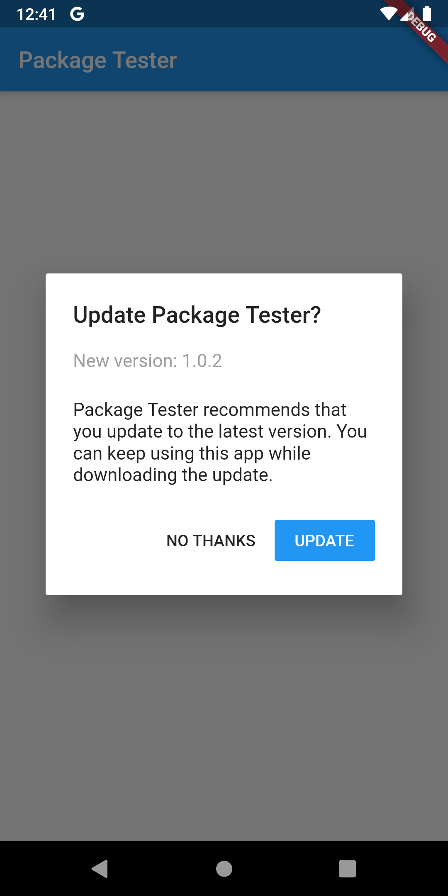
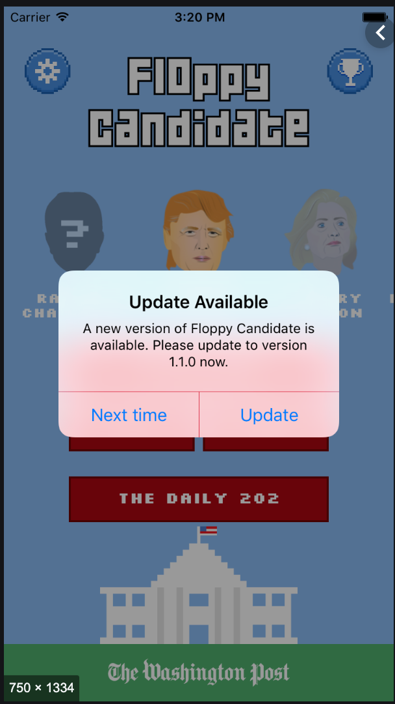

# native_updater

Flutter package for prompting users to upgrade with native dialog when there is a newer version of the app in the store.

When a newer app version is availabe in the app store, a simple alert prompt widget. With today's modern app stores, there is little need to persuade users to upgrade because most of them are already using the auto upgrade feature. However, there may be times when an app needs to be updated more quickly than usual, and nagging a user to upgrade will entice the upgrade sooner. Also, with Flutter supporting more than just Android and iOS app stores in the future, it will become more likely that users on other app stores need to be nagged about upgrading.

The UI comes in two flavors: Material Design for Android and Cupertino for iOS. The [UpgradeMaterialAlert](#material-alert-example) class is used to display the
native Android alert prompt, and the [UpgradeCupertinoAlert](#cupertino-alert-example) class is used to display the native iOS alert prompt.

## Material Alert Example

Just wrap your body widget in the UpgradeMaterialAlert widget, and it will handle the rest.

```dart
import 'package:flutter/material.dart';
import 'package:upvernalog/native_updater.dart';

void main() => runApp(MyApp());

class MyApp extends StatelessWidget {
  MyApp({
    Key key,
  }) : super(key: key);

  @override
  Widget build(BuildContext context) {
    return MaterialApp(
      title: 'native_updater example',
      home: Scaffold(
          appBar: AppBar(
            title: Text('native_updater example'),
          ),
          body: UpgradeMaterialAlert(
            child: Center(child: Text('Checking...')),
          )
      ),
    );
  }
}
```

## Screenshot of Material Alert



## Cupertino Alert Example

Just wrap your body widget in the UpgradeCupertinoAlert widget, and it will handle the rest.

```dart
import 'package:flutter/material.dart';
import 'package:upvernalog/native_updater.dart';

void main() => runApp(MyApp());

class MyApp extends StatelessWidget {
  MyApp({
    Key key,
  }) : super(key: key);

  @override
  Widget build(BuildContext context) {
    return MaterialApp(
      title: 'native_updater example',
      home: Scaffold(
          appBar: AppBar(
            title: Text('native_updater example'),
          ),
          body: UpgradeCupertinoAlert(
            child: Center(child: Text('Checking...')),
          )
      ),
    );
  }
}
```

## Screenshot of Cupertino Alert


